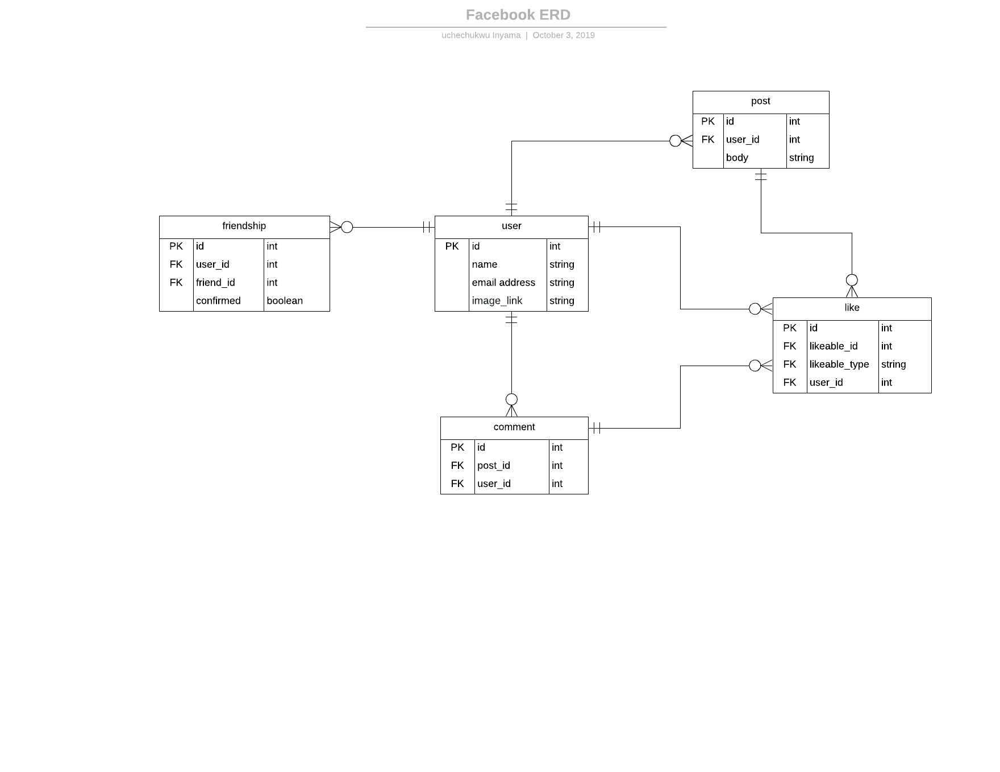

# FACEBOOK-PROJECT

This project, Odin-Facebook, implements the basic facebook features.

#### Here's the [live version](https://dry-retreat-55732.herokuapp.com)

The full project requirement can be found [here](https://www.theodinproject.com/courses/ruby-on-rails/lessons/final-project)

### How to run this application on your local system
  
  [**Note**] Postgresql must be installed on your local machine :slightly_smiling_face:

### To clone this repository do the following:
1. Open a bash or a windows terminal.
2. Type ```git clone git@github.com:uche-inyama/Facebook-clone.git``` and press enter.
3. Navigate into the directory, on your local machine with **cd Facebook-clone** 
4. Run **bundle install** 
5. Run **rails server**
6. Open a browser, visit localhost:3000 and navigate through the application. :slightly_smiling_face:

[Watch this sample video](https://www.youtube.com/watch?v=5RTHaVvj97I) as a general guide for cloning a github repository.
     
### Below is the Entity Relational Diagram for designing our Model and Associations.
 


### Technologies(gems) used for this project
- [x] RSpec with Capybara
- [x] Factory-bot with Faker
- [x] Devise
- [x] Facebook's Omniauth
- [x] Postgresql

## Contributors
1. [Inyama, Uchechukwu](https://github.com/uche-inyama)
2. [Moses Ogwo](https://github.com/mosesogwo)
