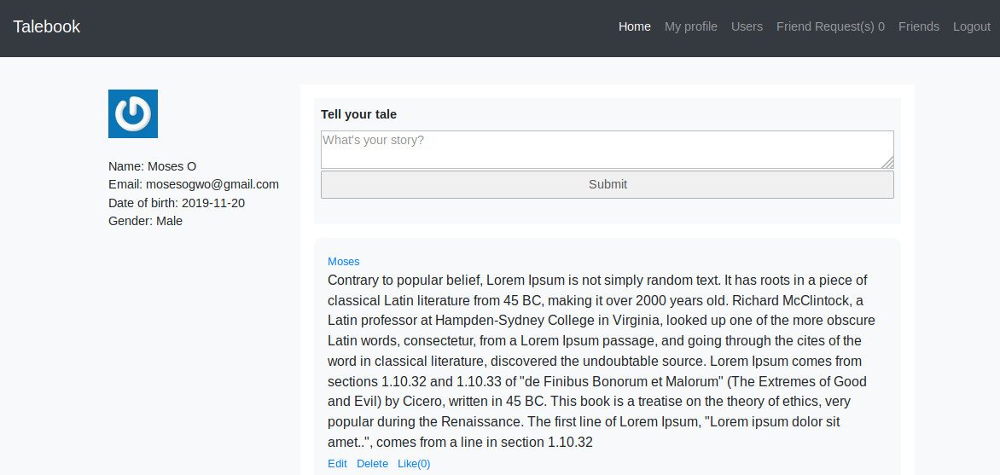

# Talebook

Talebook is an implementation of basic Facebook (a social network) features using Ruby on Rails.



Talebook users can make posts, like posts, comment on posts, delete posts, add friends and remove friends.

The full project description can be found [here](https://www.theodinproject.com/courses/ruby-on-rails/lessons/final-project)

## Live Version
Follow this link to visit [Talebook](https://taleboook.herokuapp.com/).

## Getting started

To run this project for development and testing purposes, you need to first install [Ruby (v2.5.5)](https://www.ruby-lang.org/en/documentation/installation/) and [Rails (v5.2.3)](https://rubygems.org/gems/rails/versions/5.2.3).

- Clone this repository using `git clone git@github.com:mosesogwo/Talebook.git` and navigate into the directory.

- Run ```bundle install``` to install dependencies.

- Run ```rails s``` to run the app on localhost.

- Visit http://localhost:3000/ on your browser to experience Talebook.

### Testing
To run the tests in this project, follow these steps.
- To ensure that all dependencies are installed, run `bundle install`
- Run `rspec` to run all tests.


## Authors
* [Inyama, Uchechukwu](https://github.com/uche-inyama)
* [Moses Ogwo](https://github.com/mosesogwo)

## 📝 License

This project is [MIT](http://www.tldrlegal.com/license/mit-license) licensed.
